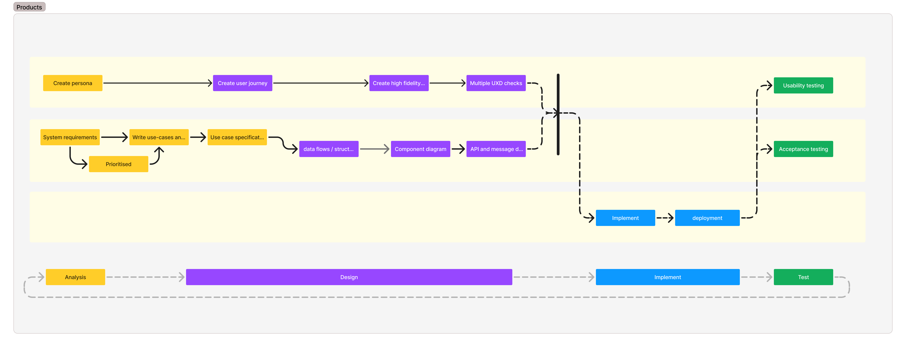

# The assignment

During the UVE lessons, we cover the following areas: user experience design, functional specification design, frontend development, and backend development.

Figure 1 shows how the products from these areas fit together. You can see that they influence one another and are related.

To understand the relationship between the products, we apply them to the veterinary practice case. You can read the stakeholders' needs in the file 'interviews.md'. The activities we carry out during this case are also activities we will ask you to complete for the final assignment in week 7. This is therefore good practice for the final assessment.

Each week, the lecturers will ask you to complete specific parts of the assignment. You should complete them and make sure they are published in your team repository. We will regularly discuss the results in class or in the IT studio.
